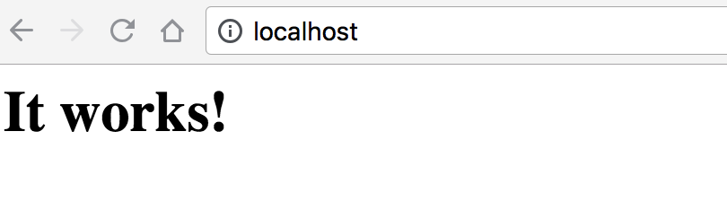
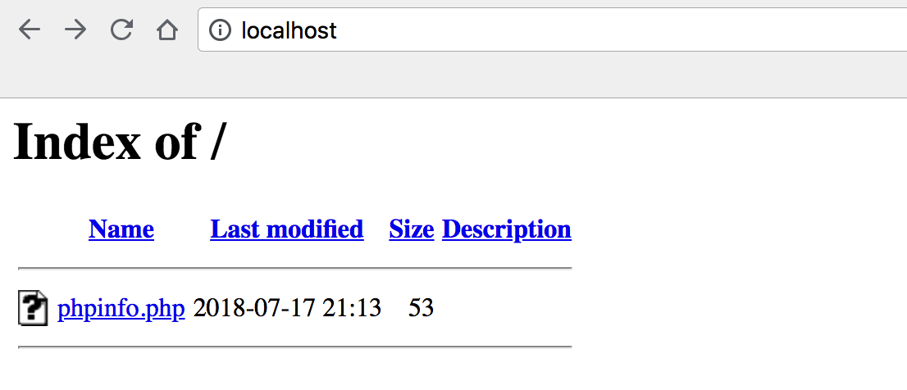

1. 启动 Apache 服务器

    ```
    sudo apachectl start
    ```

    > 其他命令：  
    > sudo apachectl restart：重启服务器  
    > sudo apachectl stop：停止服务器
    
2. 浏览器访问 __http://localhost__，显示 It works!，确认启动成功

    

3. 修改 /etc/apache2/httpd.conf
    1. 进入 /etc/apache2/，备份 httpd.conf

        ```
        cd /etc/apache2/
        sudo cp httpd.conf httpd.conf.bak
        ```

    2. 打开并修改 httpd.conf

        > 这里使用 vim ，可以用其他文本编辑器来打开和修改文件，比如 Sublime Text  
        
        ```
        sudo vim httpd.conf
        ```

    3. 在打开的 httpd.conf，查找 DocumentRoot，修改服务器根目录

        > 可以不修改 DocumentRoot 对应的路径

        ```        
        DocumentRoot "/Library/WebServer/Documents"
        <Directory "/Library/WebServer/Documents">
        修改为
        DocumentRoot "自定义的目录"
        <Directory "自定义的目录">
        ```

    4. 在第 3 步修改的地方下面，找到 “Options FollowSymLinks Multiviews”

        ```
        Options FollowSymLinks Multiviews
        插入 Indexes，修改为
        Options Indexes FollowSymLinks Multiviews
        ```

    5. 修改 DocumentRoot 对应目录的 User 和 Group
    
        > 第 3 步中没有修改目录，可以略过这步，到第 6 步继续修改

        ```
        User _www
        Group _www
        修改为
        User “DocumentRoot 对应目录的属主”
        Group “DocumentRoot 对应目录的属主的用户组”
        ```
    
    6. 解注释

        ```
        #LoadModule rewrite_module libexec/apache2/mod_rewrite.so
        #LoadModule php7_module libexec/apache2/libphp7.so
        去掉前面的 #
        ```

4. 复制 php.ini 文件

    > Mac 没有 php.ini，可以使用 php.ini.default
    > 拷贝之后，可以配置 php.ini 文件

    ```
    cp php.ini.default php.ini
    ```

5. 最后，重启服务器

    ```
    sudo apachectl restart
    ```

6. 修改成功之后，可以在服务器目录下放文件

    
